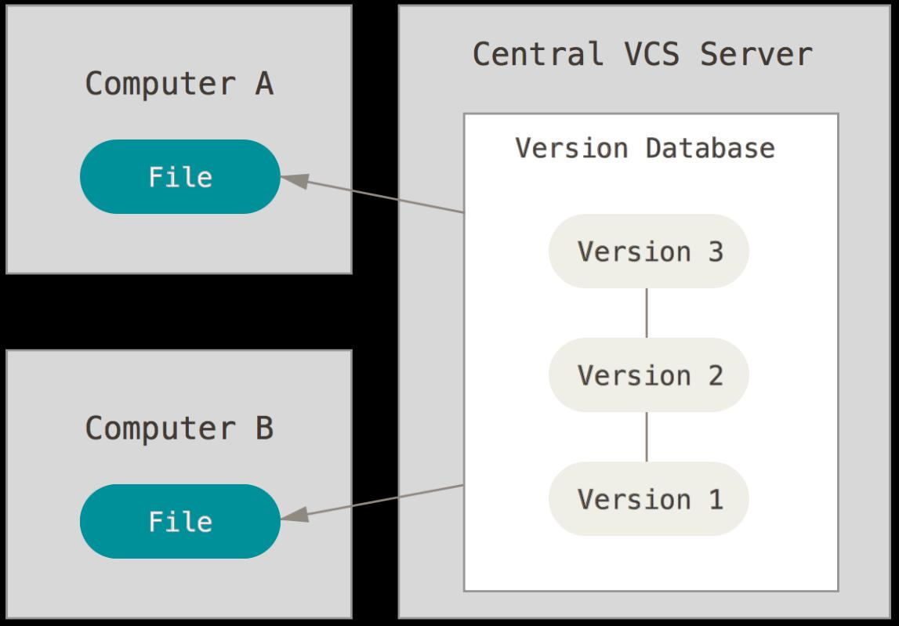

<!--
#header: MAN2
footer: MAN2 | :e-mail: sebastien.morais@proton.me
-->

# Bibliographie et inspirations 
 

- Scott Chacon : https://git-scm.com (graphes et méthodologies)

- Référence en ligne : http://gitref.org

- Git Pocket Guide par Richard Silverman

- Man gittutorial (https://git-scm.com/docs/gittutorial)

- Cheat Sheets (aide-mémoire) :
    - https://www.atlassian.com/git/tutorials/atlassian-git-cheatsheet
    -  http://ndpsoftware.com/git-cheatsheet.html#loc=local_repo;

- Internet ...

 ---

# Les enjeux du développement

- Le travail en équipe:
    - accès aux développements des autres
    - partage de l’information sur le développement

- L’historisation du travail
    - voir les dernières modifications du projet (sur un certain référentiel)
    - remonter dans le temps et voir les modifications antérieures
    - voir les différences entre les modifications
    - comprendre pourquoi certaines modifications ont été réalisées
:thought_balloon: Besoin de répondre aux question : qui ? quand ? quoi ? pourquoi ?

- La diffusion du code

---

 

 

:question: Comment avez-vous échanger du code jusqu'à maintenant ?

---

 

 

:question: Comment avez-vous échanger du code jusqu'à maintenant ?

 

Solution possible: les systèmes de contrôle de version ! 

---

# RCS

 

- Opère sur des fichiers uniques
- Introduction d'un nouveau fichier d’extension « ,v » contenant des métadonnées
- :white_check_mark: Sauvegarde des révisions ne dépend pas d’un dépôt central
- :x: L’historique des révisions peut être modifié par un utilisateur
- :x: Un seul utilisateur peut travailler sur un fichier à la fois

---

# SVN

- Système centralisé : stockage du code et métadonnées sur un serveur

- :white_check_mark: Enregistrement des modifications par *delta differencing*

- :x: Pas pratique pour le travail *hors ligne* (des enregistrement en un)

- :x: Surcoût lié au réseau

- :x: Empêche l'enregistrement de modifications local sans partager

---

# Git

- Système distribué né pour gérer les sources de Linux
- :white_check_mark: Actions extrêmement rapide
    - Nécessite l’accès au disque dure
    - N’utilise le réseau que pour publier / télécharger
- :white_check_mark: Permet le développement local
:thought_balloon: Limite la casse en cas de mauvaise manipulation
- :x: Any ? 

---

# Git

 

- Gestion des binaires larges (solution `git-lfs`)

 

- Dans le cas de projet à historique long, le téléchargement peut prendre beaucoup de temps et de place

---

# Installation de Git !

- Installation : https://git-scm.com/book/fr/v2/D%C3%A9marrage-rapide-Installation-de-Git

Une fois installé, configurez le en:

- vous créant une identité (avec vos infos):
    - `git config –-global user.name 'Morais Sébastien'`
    - `git config –-global user.email 'sebastien.morais@univ-evry.fr'`

- choisissant votre éditeur de texte:
    - `git config core.editor notepad`
    :thought_balloon: Si vous utilisez un IDE récent, l'édition peut être réalisée par le biais de celui-ci, e.g. Visual Studio Code.

---

# Fondamentaux

---

# Fondamentaux

- **Index** (*staging area*) : zone de stockage des instantanés (*snapshots*) à inclure dans la version

- **Commit** : enregistrement d'une version regroupant les *snapshots* placés dans l'index

---

# Premier projet sous git

**Repository** (dépôt) : base de données où les modifications sont stockées et à partir de laquelle les modifications sont publiées

- `git init` : initialise un dépôt Git utilisable en local 
 

- `git init --bare` : initialiser un dépôt Git sur un serveur
:thought_balloon: dépôt "installation de stockage" et pas un environnement de développement
 

- `git clone` : clone un dépôt déjà existant dans un nouveau répertoire

---

# Gestion des fichiers

- **Tracked** : au moins un enregistrement associé au ficier exite

---

# Gestion des fichiers

:question: Quelle séance d'actions a permis d'arriver à cet état ?

----

# Transition d'états

- Ajout d’un fichier dans l’index `git add README`

- Consultation du status des fichiers du dépôt `git status`

- Consultation des modifications depuis le dernier enregistrement `git diff`

- Création d'un enregistrement à partir des modifications dans l’index `git commit -m ‘Nouveau README’`

- Annulation des modifications depuis le dernier enregistrement `git checkout README`

---

# Transition d'états

- Retrait d'un fichier de l’index `git reset README` / suppression d'un enregistrement `git reset shaDuCommit`

- Annulation d'un enregistrement (ajout du négatif)
`git revert myshas238e`

- Stockage temporaire des modifications `git stash`

---

# Organisation du travail

- Chaque enregistrement est lié à son (ses) parent(s)

- Une **branche** est un pointeur vers un enregistrement

- Le pointeur d'une branche avance automatiquement et référence toujours le dernier commit réalisé

---

# Organisation du travail

- Visualation de la branche courante `git branch (-vv)`

- Création d'une branche `git branch feature/remove_group`

- Fusion d'une branche `git merge feature/remove_group`

- Suppression d'une branche `git branch -d feature/remove_group`

- Changement de branche :
    - `git checkout autre-branche`
    - `git switch autre-branche` (requiert Git récent)

---

# Organisation du travail

- Copie d'un enregistrement d’une autre branche `git cherry-pick shaDuCommit` (-x)

- Notes :
    - référence spéciale : `HEAD` (la tête de la copie de travail)
    - lorsque `HEAD` bouge (checkout), les fichiers sont modifiés
    - en général, pointeur sur le dernier commit de la branche courante.

:thought_balloon: La manière d’utiliser les branches dépend de la gestion de projet !

---

# Organisation du travail

---

# Collaboration

- Concept de *remotes*
 

- Pointeurs sur des dépôts distants
 

---

# Collaboration

- Récupération des modifications du remote `git fetch origin`

- Publication du travail local sur le dépôt distant `git push origin master`

- Récupération des modifications du remote et mise à jour de sa branche `git pull origin master`

- Mise à jour de sa branche avec une branche distance `git merge origin/master`

---

# Quelques outils

- Diff : meld, kompare, tkdiff

- Merge : kdiff3, p4merge, diffMerge

- Log : gitk, gitg, tig

- Edition : git-gui, gitkraken
:thought_balloon: https://git-scm.com/download/gui 

:thought_balloon: Certains utilitaires peuvent être intégrés dans votre IDE

---

# Gérer un conflit

- L’action de *merge* peut poser problème
:thought_balloon: Modification de la même portion d’un code sur deux branches différentes

- Git édite le fichier pour y formater les extraits en conflit

---

# Nous n'avons presque rien vu

- `git archive` : génération d’archives à partir de n’importe quelle référence

- `git bisect` : recherche d’un commit fautif de manière automatisée

- `git format-patch/am` : import/export de commits sous forme de texte (diff)

- `git grep` : plus fort et plus puissant que grep sur dépôt Git

Et plein d’autres ...

---

# Plateformes collaborative

Les forges ou source hubs ne sont pas nécessaire pour héberger votre projet MAIS elles ont plusieurs avantages :
- conçu pour accueillir les utilisateurs les plus novices 
- renforce la visibilité de votre projet
- facilite la contribution de tiers
- outils de collaborations : gestionnaire de bogue, wiki, CI, PR, permissions, ...
- retire la « complexité » de la gestion de l’hébergement 

:thought_balloon: Github, Gitlab, Sourcehut, SourceForge, ...
Pour la suite, créer un compte sur **Github** (tour du proprio)

---

# Apprendre à utiliser les branches

Réalisez les exercices sur LearnGitBranching
:thought_balloon: Comprendre Git à travers la visualisation

https://learngitbranching.js.org/

---

# Living code : contribution à un projet

- Github: voir issues, code, PR, revue de code, avantage / inconvénient d'un forge

- Git commit template

- PR / Issue template

- Workflow: fork, branch de développement, code, push, PR

- Squelette de projet du morpion avec une classe `Morpion`:
  - attributs: `plateau`, `joueur`
  - méthode: `afficher`, `jouer_coup`, `verifie_victoire`, `plateau_plein`, `changer_joueur`, `jouer`

---

# Living code : contribution à un projet

1. Dans une PR écrire les docstrings (ne pas merge)
2. Dans une seconde PR écrire l'implémentation d'une méthode
3. Dans une troisième branche écrire l'implémentation d'une autre méthode et PR dans #2
4. Répéter 3.
5. Valider #1 et regarder #2.
6. Reécrire l'historique de #2 pour ne pas avoir de conflit et garder un seul commit. Puis re décomposer le commit en plusieurs commits.

---

# Git attributes

L'utilisation de **différents OS** (Windows, Linux, MacOs) ou **éditeurs de code** (Visual Studio Code, Sublime Text, CLion) peuvent mener à des conflits.

Exemple du saut de ligne (EOL):
- sur une machine Windows : par défaut Carriage Return Line Feed (CRLF)
- sur une machine Linux/MacOS : Line Feed (LF)

**Problématique** : outil de formattage avec une propriété de fin de ligne définie

**Solution** : gitattributes pour utiliser Git et modifier le comportement par défaut de certaines opérations sur les fichiers et répertoires.
Exemple : https://github.com/ansys/pyaedt/blob/main/.gitattributes
Documentation : https://www.git-scm.com/docs/gitattributes

---

# Ignorer des révisions Git

Contexte : utilisation de `git blame` pour récupérer des informations sur le dernier changement ayant impacté une ligne de code.

Problème : L'utilisation de formatteur automatique...

Exemple en direct avec `git blame --ignore-revs-file .git-blame-ignore-vers` (twinbuilder L129) en CLI.
Intégré dans Visual Studio Code avec [Gitlens v13.4](https://help.gitkraken.com/gitlens/gitlens-release-notes-current/#version-13-4) et dans [Github](https://docs.github.com/fr/repositories/working-with-files/using-files/viewing-a-file#ignore-commits-in-the-blame-view) !

---

# Precommit

Idée générale : **analyser le code pour imposer des conventions avant commit** !

**Exemple de solution** : https://pre-commit.com/

Applications possibles :
- Convention pour les messages de commits, e.g. https://www.conventionalcommits.org/fr/v1.0.0/
- Formatter du code automatiquement, e.g. https://pypi.org/project/black/
- Valider le code au regard d'une norme, e.g. https://pypi.org/project/flake8/
- Corriger les fautes d'orthographe courantes dans les fichiers texte, e.g. https://github.com/codespell-project/codespell

Exemple : https://github.com/ansys/pyaedt/blob/main/.pre-commit-config.yaml

---

# Extra (découverte)

Pour info, je suis tombé sur cela récemment : 

https://github.com/figify/gh-metrics

Description rapide : une CLI pour calculer des métriques relatives aux PR / issues d'un projet Github.

---

