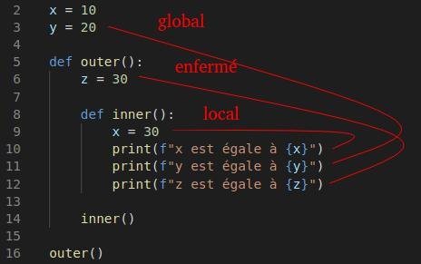

<!--
#header: Technologie Logiciel
footer: Technologies Logicielles | :e-mail: sebastien.morais@proton.me
-->

<style>
  @keyframes point-up {
    from { background-position: 50px 50px; }
    to { background-position: 50px 70px; }
  }
  @keyframes point-down {
    from { background-position: left 50px bottom 50px; }
    to { background-position: left 50px bottom 70px; }
  }
  section {
    animation: 0.5s ease-in-out alternate infinite point-up;
    #background: #fff url('https://icongr.am/feather/arrow-up.svg?color=0288d1') no-repeat 50px 50px / 80px;
    font-size: 30px;
  }
  section::before {
    content: '';
    display: block;
    position: absolute;
    top: 0;
    left: 0;
    right: 0;
    bottom: 0;
    pointer-events: none;
    animation: 0.5s ease-in-out alternate infinite point-down;
    #background: transparent url('https://icongr.am/feather/arrow-down.svg?color=0288d1') no-repeat left 50px bottom 50px / 80px;
  }
  @media (prefers-reduced-motion) {
    section, section::before {
      animation: none;
    }
  }
</style>

# MAN 2 
<br/>

**Cours**: 3 séances de 3 heures 
<br/>

**Technologie à étudier**: Python, Git & Github, Tests 

 ---

</br>

Cette séance est une introduction accélérée de Python :

- mots clef du langage

- conception orientée objet

- méthodes intégrées au langage

- typage optionnel

- « Command Line Interface » (CLI)

- séances pratiques

---

# Introduction à Python

Quels sont les avantages de Python ?
- Logiciel libre (Guido van Rossum BDFL)
- Syntaxe simple à apprendre et lisible (proche du pseudo code)
- Nombreuses bibliothèques de support : analyse de données, de l’apprentissage automatique, calculs scientifiques, …
- Possède des structures de données intégrées riches et faciles d’utilisation
- Language interprété, i.e. ne nécessite pas d'étape de compilation (sauf cas particuliers)
- Permet la programmation orientée objet

---

# Introduction à Python

Applications de la programmation Python dans la vrai vie

- Le site web communautaire Reddit est codé en Python
- Plusieurs frameworks web célèbres sont basés sur Python, e.g. Flask, Django, FastAPI, TurboGears, ...
- Modules très utilisés pour le calcul scientifique, l'apprentissage automatique, le trading algorithmique, e.g. numpy, scipy, matplotlib, ...
- SageMath est un logiciel programmable en Python 
- Langage de script utilisé dans de nombreux logiciels, e.g. GIMP, Abaqus, FreeCAD, ...

---

# Installation de Python 

- Windows : https://www.python.org/downloads/windows/

- Linux (normalement déjà installé) :
```shell
sudo apt-get install software-properties-common
sudo add-apt-repository ppa:deadsnakes/ppa
sudo apt-get update
sudo apt-get install python3.10
```

- MAC : https://www.python.org/downloads/macos/
:thought_balloon: Il y a deux options pour l’exécution d’un script depuis le Finder :
  - glissez-le vers PythonLauncher
  - PythonLauncher comme application par défaut pour ouvrir le script

---

# Mots clefs 

```python
help()
>>> keywords
```

- `as` : alias
- `finally` : exécute un bloc de code après un `try` ... `catch` ...
- `from` : utilisé pour importer une section spécifique d'un module
- `yield` : termine une fonction et retoure un générateur

---

# Règle d'écriture

:warning: L'indentation définit les blocs de codes !

```python
if True:
    print("Tout va bien")
```

Règles d’écriture d’un *identifiant*:

- Possible combinaison de minuscule, majuscule, numéro ou « _ »
→ maVariable, ma_premiere, variable_1, …
-  Ne peut pas commencer par un numéro
-  Ne peut pas contenir de caractères spéciaux, e.g. @, #, %, ?, !, …
- Peut être de longueur arbitraire !

---

# Quelques bonnes pratiques

- :white_check_mark: Snake Case (ma_fonction) :x: Camel Case (maFonction)

- Le nom d’une classe commence par une majuscule, pour les autres par une minuscule
:thought_balloon: Nommage fichier != nommage classe

- Commencer un identifiant par `_` indique que celui-ci est protégé

- Commencer un identifiant par `__` indique que celui-ci est privé
:thought_balloon: Pas totalement vrai (live code)
:warning: Si l’identifiant commence et finit par `__` alors l’identifiant est un nom spécial défini par le langage (cf slides à venir)

---

# Commentaire

</br>

Les commentaires sont des strings démarrant par «#»

```python
# Ceci est un commentaire

# print("cela ne sera pas execute")

print("cela sera execute")

print("cela aussi") # meme si j'ai mis un commentaire a cote
```

---

# Déclaration

</br>

Les déclarations sont des lignes logiques

```python
str_var = "ma_variable"

int_var, float_var = 12, 42.0

add_var = int_var + float_var

sub_var = int_var - float_var

mul_var = int_var * float_var

div_var = int_var / float_var
```

---

# Structure de données

<div class="columns">
<div>

Quelques types de données intégrés 
- Numériques: int, float, complex
- Chaîne de caractères: str
- Séquences: liste, tuple, range
- Binaire: bytes, bytearray, memoryview
- Map: dict
- Ensemble: set, frozenset
- Booléen: bool

</div>
<div>

</br>

```python
# Données numériques
int_var, float_var, complex_var = 12, 42., 10+3j

# Chaine de caratcères
str_var = "je suis" + " " + "une variable"

# Séquences
list_var, tuple_var = [1, "texte", 12.0], (1, "deux")

# Dictionnaire
dict_var = {1: "premier", "deux": 2}
```
</div>
</div>

---

# Liste des opérateurs

<div class="columns">
<div>

Liste des opérateurs Python :
- Arithmétique : +, -, *, /, %, **
- Affectation : +=, -=, *=, /=, %=, **=, //=
- Comparaison : ==, !=, >, <, >=, <=
- Logique : and, or, not
- Sur les bits : &, |, ^, ~, <<, >>

</div>
<div>

</br>

```python
# Division entière
res = 13 // 3 # res = 4

# Puissance
res = 2 ** 5 # res = 32

# Modulo
res = 13 % 3 # res = 1

# Opération binaire AND
res = 10 & 7 # res = 2 (10: 1010, 7: 0111)
```
</div>
</div>

---

# Portée d'une variable



---

# If ... Else ...

Traitement de conditions multiple avec `if` ... `elif` ... `else` ...

```python 3
val = input() # récupère une entré de l'utilisateur
val = int(val) # cas l'entrée brute (str) en entier

if val < 10:
  print("petite valeur")
elif val < 20:
  print("valeur moyenne")
elif val <= 30:
  print("grande valeur")
else:
  print("énorme valeur")
```

---

# Boucle for

Syntaxe de la boucle `for` en Python:
- mot clef `for` qui marque le début de la boucle
- une variable qui itère sur la séquence et peut être utilisé au sein de la boucle
- mot clef `in` qui indique à la variable d'itérer sur les élémets de la séquence
- une **séquence**, e.g. une liste, un tuple ou tout type d'itérateur

---

# Boucle for

</br>

```python
for word in ["banana", "apple", "house", "something"]:
  for letter in word:
    if letter == "a":
      continue
    print(f"letter: {letter}")
    if letter == "e":
      break
    else:
      pass
```

---

# Flexibilité de la boucle for

<div class="columns">
<div>

- Boucle sur une séquence en sens inverse
</br>

- Boucle sur une séquence triée
</br>

- Enumérer les valeurs et les indices
</br>

- Itérer sur plusieurs séquences (deux ou plus)

</div>
<div>

```python
list_var = ["apple", 12, 42, "banana"]
for item in reversed(list_var):
  print(item)
```

```python
list_var = [15, 12, 42, 36]
for item in sorted(list_var):
  print(item)
```

```python
list_var = ["apple", 12, 42, "banana"]
for index, value in enumerate(list_var):
  print(value)
```

```python
list_var = ["apple", "12", "42", "banana"]
another_var = [15, 12, 42, 36]
for str_var, int_var in zip(list_var, another_var):
  print(str_var, int_var)
```
</div>
</div>


---

# Boucle while

Syntaxe de la boucle `while` en Python:
- mot clef `while` qui marque le début de la boucle
- une condition : lorsque la condition est vrai, la boucle continue, sinon elle stop

---

# Boucle while

```python
var_list = ["banana", "apple", "house", "something"]
word_pos = 0
while word_pos < len(var_list):
  letter_pos = 0
  word = var_list[word_pos]
  word_pos += 1
  while letter_pos < len(word):
    letter = word[letter_pos]
    letter_pos += 1
    if letter == "a":
      continue
    print(f"letter: {letter}")
    if letter == "e":
      break
    else:
      pass
```

---

# Switch case

Contrairement à d'autres langage, Python n'a pas d'instruction `switch` !

:thought_balloon: Il est possible d'utiliser des snippets qui fonctionnent comme tel OU d'utiliser l'alternative `match`.

```python
match parametre:
  case pattern_0:
    # Code pour le pattern 0
  case pattern_1:
    # Code pour le pattern 1
  ...
  case _:
    # Code par defaut
```

---

# Opération ternaire

Il n'y a pas de mot clef spécial pour l'opérateur ternaire
:thought_balloon: Ecriture possible via `if` ... `else` ...

```python
condition = True
res = "la condition est vraie" if condition else "la condition est fausse"
```

Avantages:
- permet de remplacer des instructions simples `if` ... `else` ... par une expression d'une seule ligne;
- augmente la lisibilité du code en réduisant le nombre de lignes de code.

---

# Fonction et arguments

```python
def addition(val_0, val_1):
  """Addition of two variables.
  """
  return val_0 + val_1

def addition(val_0, *args):
  """Addition of val_0 and an arbitrary number of values.
  """
  res = val_0
  for val in args:
    res += val
  return res
```

---

# Fonction et arguments

```python
def addition(val_0, val_1, log=False):
  """Addition of two variables.
  """
  if log:
    print(f"I'm adding {val_0} and {val_1}")
  return val_0 + val_1

def addition(val_0, val_1, **options):
  """Addition of two variables while taking into account options.
  """
  if "power" in options:
    val_0 = val_0 ** options["power"]
    val_1 = val_1 ** options["power"]
  res = val_0 + val_1
  if "str_cast" in options:
    res = str(res)
  return res
```

---

# Fonction main

Il y a deux moyen d'exploiter un fichier Python:
- exécuté comme un programme, i.e. les lignes de codes sont exécutées séquentiellement;
- importé comme un module, i.e. on ne souhaite pas exécuté le code lors de l'import.

```python
def main():
  print("ceci est ma fonction main")

if __name__ == "__main__":
  main()
```

---

# Fonction anonynme

En Python, une fonction lambda est une fonction définit sans nom.
- utilisation du mot clef `lambda`;
- la syntaxe associée est *lambda argument : expression*.

```python
addition = lambda x,y: x+y
addition(12, 42)

list_var = [1, 2, 3, 4, 5]

# Ajout 10 aux valeurs de la liste
list(map(lambda x: x + 10, list_var))

# Filtre les valeurs paires de la liste
list(filter(lambda x: x%2, list_var))
```

---

# Exception

Quelques exceptions intégrées à Python: `Exception`, `IndexError`, `KeyError`, ...
:thought_balloon: Il est possible de créer vos propres exceptions

```python
arg = input()

try:
  char = arg[12]
except IndexError: # Capture une exception d'indice
  print("Une exception d'indice a été levée")
except: # Capture toute exception n'ayant pas déjà été testée
  print("Une exception a été levée")
else: # Si aucune exception n'est levée, ce bloc est exécuté
  print("Aucune exception d'indice n'a été levée")
finally: # Exécute ce code quoi qu'il arrive
  pass
```

---

# Classe

La déclaration d'une classe Python utilise le mot clef `class`
- constructeur : `__init__()`
- héritage multiple possible
- accès à la classe parent depuis les classes fille en utilisant `super()`

---

# Classe

```python
class Dog:
  species = "canine" # class attribute

  def __init__(self, name, age):
    self.name = name # public attribute
    self.__age = age # private attribute

class Bulldog(Dog):

  def __init__(self, name, age, weight):
    super().__init__(name, age)
    self.weight = weight
```

---

# Classe abstraite

Rappel: une classe abstraite permet de définir des comportements communs et des méthodes abstraites
- composée de méthodes concrètes et abstraites (i.e. pas d'implémentations)
- les classes filles doivent fournir l'implémentation des méthodes abstraites
- utilisation du module intégré `abc`

---

# Classe abstraite

```python
import abc

class MyAbstractClass(abc.ABC):
  @abc.abstractmethod
  def bar(self):
    pass

class FirstSubClass(MyAbstractClass):
  pass

class SecondSubClass(MyAbstractClass):
  def bar(self):
    print("pop")

FirstSubClass() # lève une exception car la méthode abstraite n'est pas implémentée
SecondSubClass()
```

---

# Interface

Une *interface* définit un *contrat* pour concervoir une classe:
- composée uniquement de méthodes abstraites
- les classes implémentant l'interface doivent fournir l'implémentation de toutes les méthodes

---

# Interface

```python
 import abc

 class FormalParserInterface(abc.ABC):

  @abc.abstractmethod
  def load_data(self, file_path):
    raise NotImplementedError

  @abc.abstractmethod
  def extract_text(self, file_path):
    raise NotImplementedError

class MyParser(FormalParserInterface):

  def load_data(self, file_path):
    pass
  def extract_text(self, file_path):
    pass

MyParser()
```

---

# Méthodes magiques

Ces méthodes sont une base importante de la programmation orientée objet en Python:
- méthodes toujours entourées par deux *tirets bas* (`__`)
- permettent à des objets de se comporter comme des types nativement intégrés à Python

---

# Méthodes magiques

```python
class MyFloat:

  def __init__(self, val):
    self.val = val

  def __gt__(self, other):
    if isinstance(other, MyFloat):
      return self.val > other.val
    else:
      return self.val > other

m = MyFloat(12.2)
print(m < 11)
```

---

# Méthodes magiques : prise en main

Implémentez les classes:
- `PairValue` composée des deux attributs `first_val` et `second_val` et implémentez:
  - `__add__` (addition), `__isub__` (soustraction sur place)
- `CustomAlpabet` composée de l'attribut `alphabet` et implémentez:
  - `__len__` (longueur)
  - `__getitem__` (accesseur)
  - `__iter__` (itérateur) et `__next__` (itération)

---

```python
class CustomAlphabet: # Correction "simple"
    def __init__(self, alphabet):
        self.alphabet = alphabet
        self.__index = 0

    def __len__(self):
        return len(self.alphabet)

    def __getitem__(self, index):
        return self.alphabet[index]

    def __iter__(self):
        self.__index = 0
        return self

    def __next__(self):
        if self.__index < len(self.alphabet):
            result = self.alphabet[self.__index]
            self.__index += 1
            return result
        else:
            raise StopIteration
```

---

# Typage

Depuis Python 3.5, il est possible d'annoter du code avec des indices de type !
:thought_balloon: Permet d'utiliser des outils pour avoir des *sécurités* similaires à celles des langages à typage statique.
:warning: Python **ignore** ces annotations

```python
class Person:
  def __init__(self, nom: str) -> None:
    self.__nom: str = nom

  def get_name(self) -> str:
    return self.__nom

  def set_name(self, name: str) -> None:
    self.__nom: str = name
```

---

# Module MyPy

`MyPy` est un vérificateur de type statique en Python

Pourquoi utiliser `MyPy` ?
- vérification du type *à la compilation*
  :thought_balloon: facilite la recherche de bogue
- entretien plus facile car le typage facilite la compréhension du code et agit comme une documentation

Comment installer `MyPy` ?
Dans une console, tapez `python3 -m pip install -U mypy`

Maintenant, essayez d'utiliser `mypy` sur l'un de vos programmes

---

# Property

Un mécanisme permettant de contrôler l'accès à des attributs d'une classe tout en utilisant la syntaxe des attributs.
:thought_balloon: Utilisée pour définir des getter, setter ou deleter. 

```python
class Person:
    def __init__(self, name):
        self.__name = name

    @property
    def name(self):
        return self.__name

    @name.setter
    def name(self, value):
        if not value:
            raise ValueError("Invalid name.")
        self.__name = value
```

---

# Data classes

Les data classes ont été décrit dans la PEP 557:
- classe contenant principalement des données
- peut avoir des méthodes associées
- vient avec des fonctionallités basiques déjà implémentées:
  - par défaut: instanciation, affichage, égalité
  - autres: comparaison (e.g. `<`), gelé (instance en lecture seule), ...

---

# Data classes

```python
from dataclasses import dataclass

@dataclass
class InventoryItem:
  name: str
  unit_price: float
  quantity_available: int = 0

  def total_price(self) -> float:
    return self.unit_price * self.quantity_available

item = InventoryItem("pain", 2, 10)
print(item)
print(item.total_price())
print(item == InventoryItem("pain", 2, 10))
```

---

# Les décorateurs

Un décorateur est une fonction qui modifie ou étend le comportement d'une autre fonction ou méthode sans changer son code.

```python
def my_decorator(fonction):
    def modified_function(*args, **kwargs):
        print("Before execution")
        result = fonction(*args, **kwargs)
        print("After execution")
        return result
    return modified_function

@my_decorator
def say_hey():
    print("Hey !!!")

say_hey()
```

---

# Module argparse

Module permettant de réaliser facilement des interfaces en ligne de commande (CLI), e.g. `python cli.py 1 2 3 4 --sum`

```python
import argparse

def main():
  parser = argparse.ArgumentParser(description="Traitement sur des entiers")
  parser.add_argument("integers", type=int, nargs="+", help="accumulateur d'entiers")
  parser.add_argument("--sum", action="store_true", help="somme les entiers")
  return parser

if __name__ == "__main__":
  parser = main()
  opts = parser.parse_args()
  if opts.sum:
    print(sum(opts.integers))
```

---

# Fin de séance

---

# Ou pas

Créez une classe `Vecteur` pour modéliser des vecteurs de dimension arbitraire.

Implémentez les propriétés:
- `coords`: retourne les coordonnées du vecteur
- `norm`: retourne la norme du vecteur

Implémentez les méthodes:
- multiplication par un facteur
- produit de vecteur

---

# Toujours pas

Créez un classe `Vecteur3` qui hérite de la précédente classe et qui n'accepte que troois coordonnées. Implémentez:

Les propriétés:
- `x`: première coordonnée
- `y`: seconde coordonnée
- `z` : troisième coordonnée

La méthode produit de vecteur avec un autre vecteur 3 dimensions.

---

# Pour encore plus de fun

Reprenez le TD 1 de COOL et :

1) convertissez le code Java initial pour avoir un code python fonctionnel;
2) reprenez les modifications réalisées dans les exercice 2 et 3 et appliquez les au code Python.

# Extra

Traitez l'exercice 2 du TD 2 de COOL en implémentant le patron de conception itérateur à l'aide des méthodes magique `__iter__` et `__next__`. 

