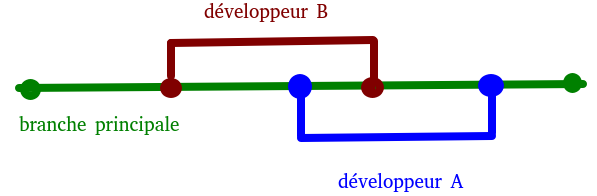
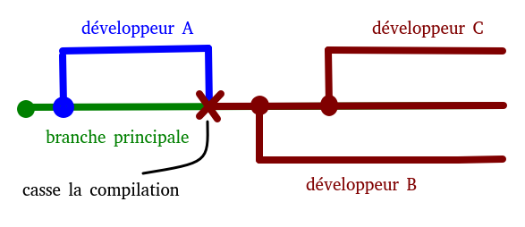
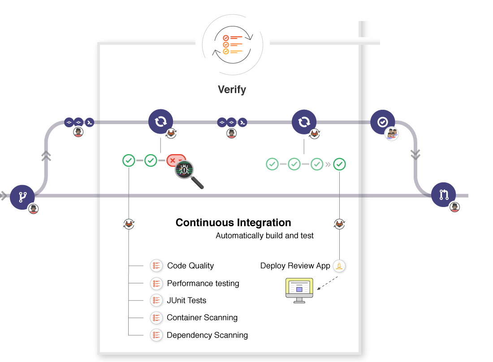

<!--
#header: Technologie Logiciel
footer: Technologies Logicielles | :e-mail: sebastien.morais@proton.me
-->

<style>
  @keyframes point-up {
    from { background-position: 50px 50px; }
    to { background-position: 50px 70px; }
  }
  @keyframes point-down {
    from { background-position: left 50px bottom 50px; }
    to { background-position: left 50px bottom 70px; }
  }
  section {
    animation: 0.5s ease-in-out alternate infinite point-up;
    #background: #fff url('https://icongr.am/feather/arrow-up.svg?color=0288d1') no-repeat 50px 50px / 80px;
    font-size: 30px;
  }
  section::before {
    content: '';
    display: block;
    position: absolute;
    top: 0;
    left: 0;
    right: 0;
    bottom: 0;
    pointer-events: none;
    animation: 0.5s ease-in-out alternate infinite point-down;
    #background: transparent url('https://icongr.am/feather/arrow-down.svg?color=0288d1') no-repeat left 50px bottom 50px / 80px;
  }
  @media (prefers-reduced-motion) {
    section, section::before {
      animation: none;
    }
  }
</style>

# Rappel et correction TD git 
<br/>

- Logiciel de gestion de versions décentralisé

- Git : branch, fetch, rebase, push, pull

- Github : issue, code, pull request, code review

---

# Tests et Intégration Continue

L'objectif de cette séance :

- Théorie, pratique et discussion sur les tests
  - back box / white box
  - qu'est ce qu'un bon test ?
  - unitaire, intégration, système, ...
  - framework de test
  - mock et patch

- Intégration Continue

---

# Test en boîte noire

- Approche utilisée pour tester un logiciel **sans connaissance interne**

- Tests basés sur des attentes externes

- Type de test idéal pour des tests **hauts niveaux**, e.g. test système, end-to-end, ...

- Connaissances en programmation non requises

- Les tests peuvent démarrer après la rédaction d'un document de spécification

---

# Test en boîte noire

- Tests réalisés par l'utilisateur final, le développeur et le testeur

- Niveau de granularité : faible

- Temps : moins long et exhaustif que l'approche boîte blanche

- Faible niveau de couverture

- Erreurs de code ne peuvent être identifiées

---

# Test en boîte noire

- L'utilisateur doit être en mesure d'identifier toute fonctionnalité manquante car le champ d'application de ce type de test est large

- La sélection de la donnée de test est délicate car les données de test ont de larges possibilités

- Exemple illustratif : une télévision
  - utilisateur : regarde la télévision
  - pas de connaissance sur sa construction ou son fonctionnement interne
  - connaissance de son utilisation, i.e. allumer, éteindre, changer de chaînes, ...

---

# Test en boîte noire (TLDR)

- :white_check_mark: Simplicité : tests simple à réaliser

- :white_check_mark: Rapidité : court temps de préparation des tests

- :white_check_mark: Impartialité : le système fonctionne ou non
:thought_balloon: pas de contestation possible

---

# Test en boîte noire (TLDR)

- :x: Superficialité : test non exhaustif
:thought_balloon: ne permet pas de savoir quel partie du code est en cause en cas de problème

- :x: Redondance : champ d'action souvent inclus dans d'autres tests

- :x: Détection tardive : les défauts sont identifiés une fois le code de base développé

---

# Test en boîte blanche

- Approche de test dans laquelle **la structure interne est connue** du testeur
- Tests basés sur le fonctionnement interne
- Type de test idéal pour des tests **bas niveaux**, e.g. test unitaires, d'intégrations, ...
- **Connaissances en programmation requises**
- Objectif : vérifier la qualité du code de l'application
- Les tests peuvent démarrer après la rédaction d'un document de conception détaillé

---

# Test en boîte blanche

- Tests généralement réalisés par les développeurs et les testeurs
- Niveau de granularité : **élevé**
- Temps : long et plus exhaustif que l'approche boîte noire
- **Haut niveau de couverture**
:thought_balloon: tous les "chemins" sont facile à couvrir car il peuvent être testés en partie
- Aide à identifier les erreurs cachées et à
optimiser le code !

---

# Test en boîte blanche

:thought_balloon: Le testeur ne peut pas identifier les fonctionnalités manquantes car le champ d'application est limité uniquement à la fonctionnalité implémentée

- La sélection de la donnée de test est facile car une seule partie de la fonctionnalité est ciblée à la fois !

- Exemple illustratif : une voiture et un mécanicien 
  - testeur : mécanicien automobile
  - un mécanicien automobile doit connaître la
structure interne du moteur de la voiture pour la
réparer

---

# Test en boîte blanche (TLDR)

- :white_check_mark: Anticipation : repérer des points bloquants (futur problèmes)

- :white_check_mark: Optimisation : le testeur peut optimiser le code

- :white_check_mark: Exhaustivité : possibilité de tester l'intégralité du code
:thought_balloon: Tester l'application sans rien laisser passer, i.e. repérer les bugs et vulnérabilités cachées

---

# Test en boîte blanche (TLDR)

- :x: Complexité : besoin de compétences en programmation et de connaissances de l'application

- :x: Durée : tests pouvant être très longs

- :x: Industrialisation : nécessite l'utilisation d'outils tel que des analyseurs de code, débogueurs, ...
:thought_balloon: Peut impacter les performances et les résultats

- :x: Intrusion : nécessite de laisser son code accessible à la vue du testeur

---

# Qu'est ce qu'un bon test ?

---

# Qu'est ce qu'un bon test ?

- Facile à lancer et rapide !
:thought_balloon: Limiter l'attente entre une modification et le résultat des tests évite la perte de concentration
:thought_balloon: Tests facile à lancer et rapide incitent à expérimenter de nouvelles idées

- Reproductible et fiable !
:thought_balloon: Un test qui échoue de temps en temps diminue la confiance accordée aux tests et le soin qu'on y accorde

- Automatisé !
:thought_balloon: Un test qui n'est pas automatisé sera un jour oublié ...

---

# Qu'est ce qu'un bon test ?

- Respecte son périmètre
:warning: Eviter la mauvaise gestion de données ou de ressources externes :
  - test unitaire : pas de ressources externes et recours à des mocks, stubs, patchs, …
  - test d'intégration : utilisation de ressources externes !

- Facile à interpréter
:thought_balloon: Les tests sont écrits dans le but qu'ils échouent !
:thought_balloon: Important de facilement comprendre ce qui a cassé et pourquoi :
  - nommage explicite du test
  - message explicite associé aux fonctions/méthodes d'assertion
  - éviter l'interdépendance entre les tests !

---

# Test unitaire

Qu'est ce qu'un test unitaire ?

---

# Test unitaire

Qu'est ce qu'un test unitaire ?

Test de type boîte blanche dans lequel des unités ou composants individuels sont testés !

- Objectif : valider que chaque unité de code fonctionne comme prévu
- Isolation d'une partie du code et vérification de son exactitude
:thought_balloon: Une unité peut être : fonction / méthode / module / class / ...
- Généralement écrit par les développeurs pendant la phase de développement
- Exécution rapide car morceau de code isolé

---

# Test unitaire

Pourquoi faire des tests unitaires ?

---

# Test unitaire

Pourquoi faire des tests unitaires ?

- Corriger des bogues en début de cycle de développement
:thought_balloon: Réduit les coûts !

- Premier niveau de test dans plus types de cycles de développement (e.g. SDLC, STLC, modèle en V)

- Comprendre pourquoi un morceau de code fonctionne un jour et pas le suivant :
  - mécompréhension de ce que doit faire le code
  - cas limites qui n'étaient pas considérés
  - mise à jour / version obsolète d'une dépendance

---

# Test unitaire

Extra:

- Permettent de comprendre la base de code des tests et d'apporter rapidement des modifications

- Servent de documentation au projet

- Aident à la réutilisation de code (dans un autre projet)

---

# Test unitaire

- Initialisation (fonction setUp)
Définition d'un environnement de test reproductible (fixture)

- Exercice
Le code à tester est exécuté

- Vérification (utilisation de fonctions *assert*)
  - Comparaison des résultats obtenus avec ceux escomptés
  - Résultat du test : Succès / Échec (/ Évité / …)

- Désactivation (fonction tearDown)
  - Désinstallation de l'environnement de test (fixture)
  - Ne pollue pas les tests suivants

---

# Test d'intégration

Qu'est ce qu'un test d'intégration ?

---

# Test d'intégration

Qu'est ce qu'un test d'intégration ?

Test de type boîte blanche dans lequel des unités ou composants sont introduits logiquement et testés comme un groupe

- Objectif : exposer des erreurs non détectable dans les tests unitaires
- Cible : erreurs liées dans les interactions des différentes interfaces entre elles

---

# Test d'intégration

Les tests d'intégrations :

- Prennent en entrée des modules ayant été testés unitairement

- Regroupent ces modules en agrégats plus importants

- Appliquent à ces agrégats des tests définis dans un plan de test d'intégration

- Fournissent en sortie le système intégré prêt pour les tests système

---

# Test d'intégration

Pourquoi faire des tests d'intégration ?

---

# Test d'intégration

Pourquoi faire des tests d'intégration ?

- Un module est généralement conçu par un développeur dont la compréhension et la logique de programmation peut différer des autres programmeurs

- Au moment du développement d'un module, les exigences d'un client peuvent évoluer
:thought_balloon: Celles-ci peuvent ne pas être testées unitairement et on a besoin des tests d'intégration

---

# Test d'intégration

- Une mauvaise gestion des exceptions peut causer des problèmes

- Les interfaces avec le matériel externe peuvent être erronées

- Les interfaces des modules logiciels avec la base de données peuvent être erronées

---

# Test système

Qu'est ce qu'un test système ?

---

# Test système

Qu'est ce qu'un test système ?

Test de type boîte noire qui valide le logiciel complet et entièrement intégré

- Objectif : évaluer les spécifications du système de bout à bout, i.e. tester l'interface avec d'autres logiciels / matériels

- Consiste à tester le code pour :
  - Vérifier comment les composants interagissent entre eux et avec le système dans son ensemble
  - Tester de manière approfondie chaque entrée du logiciel afin de vérifier les sorties souhaitées
  - Tester l'expérience de l'utilisateur avec l'application

---

# Framework de test : unittest

- Contient à la fois un framework de test et un programme d'exécution de tests

- Intégré à la bibliothèque standard de Python depuis la version 2.1

- Exigences pour écrire et exécuter des tests :
  - les tests sont dans des classes en tant que méthodes
  - l'utilisation de méthodes d'assertion spéciales de la classe `unittest.TestCase`

---

# Framework de test : unittest

- Implémentez une classe `Point3D` qui encapsule trois coordonnées et possède une méthode `has_null_coordinate`.

- Implémentez les tests associés.

```python
import unittest
from point3d import Point3D

class TestPoint3D(unittest.TestCase):

  def setUp(self):
    ...
```

---

# Framework de test : unittest

<div class="columns">
<div>

```python
class Point3D:

  def __init__(self, x, y, z):
    self.x = x
    self.y = y
    self.z = z

  def has_null_coordinate(self):
    """Return if the coordinate is null.

    >>> point = Point3D(0,1,2)
    >>> point.has_null_coordinate()
    True
    """
    if self.x == 0 or self.y == 0 or self.z == 0:
        return True
    return False
```
</div>
<div>

```python
import unittest
from point3d import Point3D

class TestPoint3D(unittest.TestCase):

  def setUp(self):
    self.point_non_null = Point3D(1, 2, 3)
    self.point_x_null = Point3D(0, 2, 3)
    self.point_y_null = Point3D(1, 0, 3)
    self.point_z_null = Point3D(1, 2, 0)

  def test_has_null_coordinate(self):
    """Test that point has null coordinate.""" 
    self.assertTrue(self.point_x_null.has_null_coordinate())
    self.assertTrue(self.point_y_null.has_null_coordinate())
    self.assertTrue(self.point_z_null.has_null_coordinate())

  def test_has_not_null_coordinate(self):
    """Test that point has not null coordinate."""
    self.assertFalse(self.point_non_null.has_null_coordinate())

if __name__ == "__main__":
  unittest.main()
```
</div>

---

# Framework de test : pytest

- Framework de développement de test le plus populaire
- Recherche de lui même les tests unitaires (modules / fonctions dont le nom commence par `test`₎
- Des messages claires
- Les méthodes *setUp* et *tearDown* sont remplacées par des *fixtures*
- Possibilité de paramétrer vos tests
- Sait utiliser les tests d'autres frameworks, e.g. unittest et doctest
- N'est pas directement intégré dans l'installation de base

---

# Framework de test : pytest

<div class="columns">
<div>

```python
class Point3D:

  def __init__(self, x, y, z):
    self.x = x
    self.y = y
    self.z = z

  def has_null_coordinate(self):
    """Return if the coordinate is null.

    >>> point = Point3D(0,1,2)
    >>> point.has_null_coordinate()
    True
    """
    if self.x == 0 or self.y == 0 or self.z == 0:
        return True
    return False
```
</div>
<div>

```python
from point3d import Point3D

def test_has_null_coordinate():
  """Test that point has null coordinate."""
  point_x_null = Point3D(0, 2, 3)
  assert point_x_null.has_null_coordinate()
  point_y_null = Point3D(1, 0, 3)
  assert point_y_null.has_null_coordinate()
  point_z_null = Point3D(1, 2, 0)
  assert point_z_null.has_null_coordinate()

def test_has_not_null_coordinate():
  """Test that point has not null coordinate."""
  point_non_null = Point3D(1, 2, 3)
  assert not point_non_null.has_null_coordinate()
```
</div>

---

# Les mocks

- Objets simulés qui reproduisent le comportement d'objets réels de manière contrôlée
→ utilisé pour tester un objet réel mais lié à un objet inaccessible / non implémenté

- Exemple d'utilisation :
  - Éviter les comportements non déterministes, e.g. l'heure courante, ...
  - Objet ayant des états difficiles à reproduire
  - Objet ayant une initialisation trop longue
  - Objet n'existant pas
  - Objet dont le comportement peut changer
  - Inclure des attributs/méthodes à des fins de test

---

# Les mocks - exemple illustratif

Nous souhaitons :
1. récuperer des données utilisateurs contenues dans une base de données;
2. réaliser quelques traitements.

Dans la vrai vie, les objets recupérés dans la base de donnees sont des utilisateurs et ont pour attributs:
- id
- firstname
- lastname
- join_date
- expiration_date

---

# Les mocks - exemple illustratif

```python
def has_user_expired(user) -> bool:
  """Verifie si l'utilisateur a expiré."""
  if user.expiration_date < dt.datetime.now():
      return True
  return False

def test_has_user_expired_success():
  """Test qu'un utilisateur a bien expiré."""
  user = Mock()
  # Expiration hier
  user.expiration_date = dt.datetime.now() - dt.timedelta(days=1)
  assert has_user_expired(user)
```

---

# Les patchs

- Substitution d'un objet dans un module par un autre objet:
  - appel d'une API externe;
  - appel de fonction / création d'objet prenant du temps.

Exemple de syntaxe :
→ @patch(‘package.module.target')

:thought_balloon: Ne *patcher* que quelques *callables* par tests !

---

# Les patchs - exemple illustratif

Fichier play_patch.py
```python
def get_all_users(db):
  results = db.query("users").all()
  return results

def has_user_expired(user) -> bool:
  res = user.expiration_date < dt.datetime.now() 
  return res

def find_expired_users(db):
  expired_users = []
  users = get_all_users(db)
  for user in users:
      if has_user_expired(user):
          expired_users.append(user.id)
  return expired_users
```

---

# Les patchs - exemple illustratif

```python
import datetime as dt
from mock import Mock, patch
from play_patch import find_expired_users

@patch("play_patch.get_all_users")
def test_find_expired_users(mocked_get_all_users):
    db = Mock()
    mocked_get_all_users.return_value = [
        Mock(id=1, expiration_date=dt.datetime.now() + dt.timedelta(days=1)),
        Mock(id=2, expiration_date=dt.datetime.now() + dt.timedelta(days=2)),
        Mock(id=3, expiration_date=dt.datetime.now() - dt.timedelta(days=1)),
        Mock(id=4, expiration_date=dt.datetime.now() - dt.timedelta(days=2)),
        Mock(id=5, expiration_date=dt.datetime.now()),
    ]
    res = find_expired_users(db)
    expected_res = [3, 4, 5]
    assert expected_res == res
```

---

# Intégration continue (CI)

*Ensemble de pratiques utilisées en **génie logiciel** consistant à vérifier à chaque modification de **code source** que le résultat des modifications **ne produit pas de régression** dans l'application développée.*

---

# Intégration continue (CI)

Objectifs :
- Détecter les erreurs aussi vite que possible
:thought_balloon: Les problèmes sont résolus pendant que les développements sont encore frais dans la tête des développeurs

- Réduire les problèmes d'intégration
:thought_balloon: Les petits problèmes sont plus faciles à résoudre

- Eviter l'accumulation de problèmes
:thought_balloon: Développer sereinement de manière collaborative

---

# Intégration continue (CI)

Pourquoi est-ce que c'est important (au niveau individuel) ?

---

# Intégration continue (CI)

Pourquoi est-ce que c'est important (au niveau individuel) ?

Vous **passerez moins de temps à** :

- Vous inquiéter de l'introduction d'un bogue à chaque fois que vous apportez des modifications.

- Réparer le désordre que quelqu'un d'autre a créé pour que vous puissiez intégrer votre code.

- Vous assurer que le code fonctionne sur chaque machine, système d'exploitation et navigateur.

---

# Intégration continue (CI)

Pourquoi est-ce que c'est important (au niveau individuel) ?

Vous **passerez plus de temps à** :

- Résoudre des problèmes intéressants

- Ecrire du code correcte avec votre équipe

- Co-écrire des produits qui apportent de la valeur aux utilisateurs

---

# Intégration continue (CI)

Pourquoi est-ce que c'est important (au niveau équipe) ?

---

# Intégration continue (CI)

Pourquoi est-ce que c'est important (au niveau équipe) ?

:thought_balloon: Changement de culture de l'ingénierie où vous livrez de la valeur souvent et rapidement. La collaboration est encouragée et les bogues sont détectés tôt.

L'intégration continue va :
- vous rendre, vous et votre équipe, plus rapides;
- vous donner l'assurance de construire un logiciel stable & moins de bogues;
- garantir que votre logiciel fonctionne sur d'autres machines;
- éliminer des surcoûts pour vous permettre de vous consacrer à l'essentiel;
- réduire le temps passé à résoudre des conflits.

---

# Concept clé : référentiel unique

- Collaboration avec d'autres personnes
  - avoir un référentiel de code source partagé
  - développeurs travaillent sur une copie locale
  - les modifications sont fusionnées dans le révérenciel centrale

- Utilisation d'un système de contrôle de version
:thought_balloon: Utilisation de Git pour gérer le flux de travail
:thought_balloon: Utilisation d'un service externe pour héberger le code source, e.g. Github



---

# Concept clé : automatiser le build

Build : prendre le code source brut, et ce qui est nécessaire à son exécution, pour le traduire en un format que les ordinateurs peuvent exécuter.
:thought_balloon: Dans notre cas, Python est un langage interprêté => pas nécessaire et focalisation sur l'exécution des tests 

Contexte qui s'en rapproche le plus : utilisation de bibliothèques, paquets ou frameworks non *builtin*.
:thought_balloon: Stockage des dépendances nécessaires et test d'installation (*smoke test*)

---

# Concept clé : automatiser le build

Intérêt de la CI : assurer que tout le monde travail sur une base stable connue !



Autre avantage : encourage à commiter fréquemment
- notification rapide des changements et constat de conflits
- décomposition du travail en morceau (simple à suivre et tester)
- facilite la localisation d'une erreur

---

# Concept clé : automatiser les tests

- Tout le monde apportant des modifications plusieurs fois par jour, il est important de savoir que votre code n'a pas introduit de bogue ou cassé d'autres éléments !

- Bonne habitude : si vous écrivez du code, écrivez des tests !
:warning: Au minimum, chaque nouvelle fonction doit avoir un test unitaire

- Exécution automatique des tests :
  - attire l'attention sur les problèmes révélés par les tests
  - assure que personne n'oublie d'exécuter les tests localement

:warning: Les tests ne garantissent pas l'absence de bogues mais protège de modification non réfléchies

---

# CI : workflow



Image modifiée de https://docs.gitlab.com/ee/ci/introduction/

---

# Outils de CI

<div class="columns">
<div> 

- Gitlab-CI : https://gitlab.com
</br>
- Github-CI : https://github.com
</br>
- Jenkins : https://jenkins.io
</br>
- Travis CI : https://travis-ci.org
</br>
- Circleci : https://circleci.com
</br>
- Buddy : https://buddy.works

</div>
<div>


</div>

---

# Premiers pas avec Github CI

Le terme *tester* doit être interprété au sens large, i.e. il peut signifier tester (intégrations/unitaires/…), analyser statiquement, vérifier du style, ...

- Workflow : un ensemble de *jobs* à exécuter, e.g. "ci_cd"
- Job : une étape logique du workflow, e.g. "smoke tests"
- Step : une étape logique du workflow, e.g. "installation des dépendances" 
- Runner : Github met à disposition des *runners* sur différents OS afin d'exécuter les *jobs* (en parallèle si possible)

---

# Premiers pas avec Github CI

Live :
- https://github.com/ansys/actions
- https://github.com/ansys/pyaedt 

Les fichiers de configuration sont embarqués dans les sources:
- la CI évolue de pair avec le code
- tout nouveau commit sera à jour avec la CI
- chaque branche peut avoir ses propres worfklows !

---

# Exercice Pizzeria 

Coder les classes `Pizza`, `CartePizzeria` et `CartePizzeriaException`. La classe `CartePizzeria` doit implémenter les méthodes suivantes :

- `is_empty()`: retourne un booléen indiquant si la carte est vide ou non

- `nb_pizzas()`: retourne le nombre de pizzas de la carte

- `add_pizza(pizza)`: ajoute une pizza à la carte

- `remove_pizza(name)`: retire la pizza nommée `name` de la carte, si celle-ci n'existe pas, lève une exception `CartePizzeriaException`.
